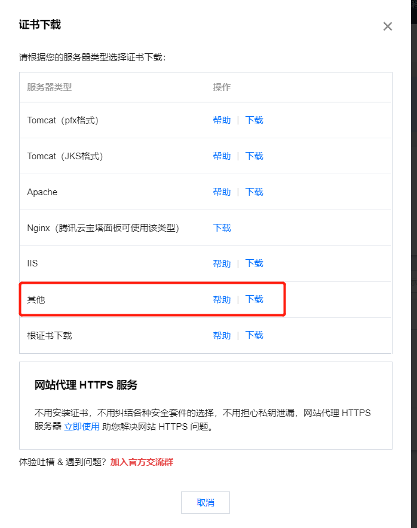

# 长度Docsify

中文文档[docsify](https://docsify.js.org/#/zh-cn/)

## 前期准备

**安装依赖：**

````
yum install -y gcc make gcc-c++ openssl-devel wget
````


**安装Node.js**

创建目录：`mkdir /usr/local/nodejs`

下载Node.js: `wget https://nodejs.org/dist/v12.14.0/node-v12.14.0-darwin-x64.tar.gz`

解压：`tar -xvf node-v12.14.0-linux-x64.tar`

配置环境变量：

````txt
vim /etc/profile

在配置文件添加
export NODE_HOME=/usr/local/nodejs/node-v12.14.0-linux-x64/bin/node
export PATH=$PATH:$NODE_HOME/bin

重新加载配置文件
source /etc/profile
````

建立软连接：后面的`/usr/local/bin/node/nmp`是固定写法

````
ln -s /usr/local/nodejs/node-v12.14.0-linux-x64/bin/node /usr/local/bin/node
ln -s /usr/local/nodejs/node-v12.14.0-linux-x64/bin/npm /usr/local/bin/nmp
````


## 安装Docsify

全局安装：`npm i docsify-cli -g`


## 初始Docsify

创建web目录：`mkdir /usr/local/web/docsify`

初始化docsify：`docsify init /usr/local/web/docsify` 

刚刚创建的docsify文件内自动生成下面三个文件

* .nojekyll
* index.html
* README. md


## 运行Docsify

本地运行：`docsify serve docsify`  默认访问 `http://localhost:3000` 实时预览效果


## 部署到服务器

使用Nginx反向代理服务器来部署

````txt
server {
    listen       80;
    server_name  localhost;

    location / {
        root   /usr/local/web/docsify;     # 指定到docsify目录
        index  index.html index.htm;
    }
    ...... 
}
````


Nginx命令：

启动：./usr/local/nginx/sbin/nginx

重启：/usr/local/nginx/sbin/nginx -s reload


# 开启SSL

配置ssl证书，使得网站支持https的访问。

**上传证书**

1. 下载证书



2. 证书申请到后，一共有四个文件。


在nginx目录下创建cert目录 `mkdir cert`，将后缀为`.key`和`.crt`的文件上传到此目录


**安装SSL模块**

1. 检查是否已经安装了ssl模块，`/usr/local/nginx/sbin/nginx -V`注意大写V

   如果configure arguments后面出现 `--with-http_ssl_module`，则证明已经安装了ssl模块。跳过下面步骤

2. 进入nginx目录的`nginx-1.18.0`目录，执行 `./configure --prefix=/usr/local/nginx --with-http_ssl_module`

3. 使用`make`命令编译，当前目录下出现`objs`文件夹。(千万不要执行`make install`因为`make`用来编译，而`make install`是安装，会覆盖你已经安装过的Nginx)

4. 执行`cp ./objs/nginx /usr/local/nginx/sbin`，替换旧的`nginx`文件

5. 再次执行`/usr/local/nginx/sbin/nginx -V`，发现出现`--with-http_ssl_module`


**配置nginx.conf文件**

````txt
server {
    listen       443 ssl;
    server_name  rainupup.cn;

    # 证书的位置
    ssl_certificate      /usr/local/nginx/cert/rainupup.cn_bundle.crt;
    ssl_certificate_key  /usr/local/nginx/cert/rainupup.cn.key;
	
    ssl_session_cache    shared:SSL:1m;
    ssl_session_timeout  5m;


    #请按照以下协议配置
    ssl_protocols TLSv1.2 TLSv1.3;
    #请按照以下套件配置，配置加密套件，写法遵循 openssl 标准。
    ssl_ciphers ECDHE-RSA-AES128-GCM-SHA256:HIGH:!aNULL:!MD5:!RC4:!DHE;
    ssl_prefer_server_ciphers on;

    location / {
        root   /usr/local/web/docsify;     # 指定到docsify目录
        index  index.html index.htm;
    }
}
#监听80端口,并重定向到443
server{
    listen 80;
    server_name rainupup.cn;
    rewrite ^/(.*)$ https://rainupup.cn:443/$1 permanent;
}
````

或者

````txt
server {
	listen 80;
    listen       443 ssl;
    server_name rainupup.cn;
    # 证书的位置
    ssl_certificate      /usr/local/nginx/cert/rainupup.cn_bundle.crt;
    ssl_certificate_key  /usr/local/nginx/cert/rainupup.cn.key;

    ssl_session_cache    shared:SSL:1m;
    ssl_session_timeout  5m;


    #请按照以下协议配置
    ssl_protocols TLSv1.2 TLSv1.3;
    #请按照以下套件配置，配置加密套件，写法遵循 openssl 标准。
    ssl_ciphers ECDHE-RSA-AES128-GCM-SHA256:HIGH:!aNULL:!MD5:!RC4:!DHE;
    ssl_prefer_server_ciphers on;

    location / {
        root   /usr/local/web/docsify;     # 指定到docsify目录
        index  index.html index.htm;
    }
}
````

**重启nginx** `/usr/local/nginx/sbin/nginx -c /usr/local/nginx/conf/nginx.conf`


> 问题：配置SSL 并且监控80端口，无法通过http访问。莫名其妙又可以访问了
>
> 此问题未能解决
